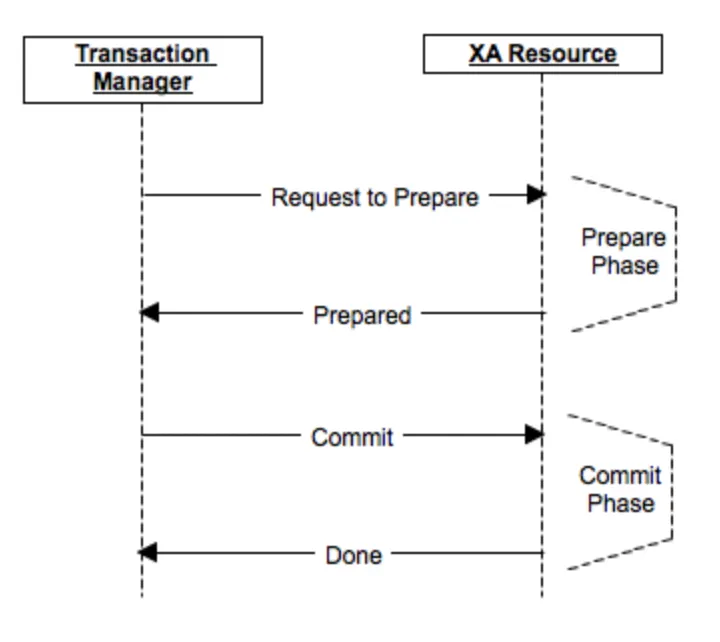

# Distributed Transactions

## 📌 Behind Zomato’s 10-Minute Food Delivery Guarantee

## 🔄 What is a Distributed Transaction? (2 Phase Commit Protocol)
A distributed transaction spans multiple networked systems (or services) that must all succeed or fail together — preserving ACID properties.

Guarantee that all subsystems (restaurant, delivery, inventory, payment) either commit or rollback together, to ensure consistent order fulfillment in under 10 minutes.

## ✅ Phase 1: Prepare Phase (Voting Phase)
Goal: Ask each subsystem if they are ready to commit.

Algorithm:
1. The Order Service (Coordinator) starts the transaction.
2. Generates a unique Transaction ID.
3. Sends PREPARE requests to:
   - Restaurant Service
   - Delivery Service
   - Inventory Service
   - Payment Service
4. Waits for all subsystems to reply with either:
   - READY → OK to commit
   - NO / Timeout → Cannot commit

## ✅ Phase 2: Commit Phase (Decision Phase)
Goal: Finalize the transaction (commit or rollback) based on responses.
Algorithm:
1. If all participants replied READY, send COMMIT(TX_ID) to all.
2. If any participant replied NO or timeout, send ROLLBACK(TX_ID) to all.

## Zomato 10-Minute Delivery Flow (as Distributed Transaction)

| Step | Business Logic                               | Engineering Algorithm Applied |
| ---- | -------------------------------------------- | ----------------------------- |
| 1️⃣  | User places order                            | Coordinator starts 2PC        |
| 2️⃣  | Restaurant checks if it can prepare fast     | PREPARE message to Restaurant |
| 3️⃣  | Delivery partner availability near user      | PREPARE to Delivery Service   |
| 4️⃣  | Inventory check for packaging                | PREPARE to Inventory Service  |
| 5️⃣  | Pre-authorization of payment                 | PREPARE to Payment Service    |
| 6️⃣  | All respond READY → commit the transaction   | Send COMMIT to all            |
| 7️⃣  | If any says NO → rollback entire transaction | Send ROLLBACK to all          |

## Optional Enhancements (Failure Handling)
Crash Recovery Protocol (simplified):
- If Coordinator crashes before commit: Participants stay in READY state (blocking).
- If crash occurs after commit message sent: Participants finish commit based on persisted logs or retries.

## Failure Handling in Mission-Critical Systems
To ensure consistency, durability, and guaranteed recovery even in case of:
Service crashes
Network failures
Partial commits or unresponsive components

###  Write-Ahead Logging (WAL) – Core Concept
A Write-Ahead Log is a system-level technique where every intended change is written to a log before it is applied to the actual system state (e.g., DB, cache, external APIs).
Used by: Databases, Order Coordinators, State Machines

Algorithm Steps:
- Before sending PREPARE or COMMIT:
   Log: TX_ID - START - participants = [ ...]
- Before sending COMMIT:
   Log: TX_ID - COMMIT
- If Crashed before notifying all:
   On recovery --> read log --> resume COMMIT or ROLLBACK

Example: Order Service(Coordinator) WAL Flow:
TX_ID: 1234
- Step 1: Log "TX_ID=1234 START Restaurant,Delivery,Inventory,Payment"
- Step 2: Send PREPARE to all
- Step 3: Receive READY from all
- Step 4: Log "TX_ID=1234 COMMIT"
- Step 5: Send COMMIT to all
If Order Service crashes after Step 4, it can re-send COMMIT on recovery.

### Kafka / Distributed Logs for Event Consistency
Kafka is a distributed, durable, and high-throughput log system used to record every event or state change that happens across microservices.

Algorithm Steps:

Producer Flow (e.g Logstash, Order Service)
- Step 1: Each stage change --> produces a message to a topic:
        - `transcation-events` or `order-events`
- Step 2: Message contains:
        - `TX_ID` State(`PREPARE,READY,COMMIT,ROLLBACK`)
        -  Timestamp, Microservice name

Consumer Flow (e.g Participant Services)

- Step 1: Services subscribe to Kafka topics
- Step 2: Replay messages or resume failed steps(idempotent behaviour)

### 🛡️ Combined Strategy: WAL + Kafka
| Component          | Purpose                               |
| ------------------ | ------------------------------------- |
| **WAL (Local)**    | Ensures individual service durability |
| **Kafka (Global)** | Ensures system-wide consistency       |

### 🧩 Summary: Failure Recovery Design in Zomato

| Area                | Tool/Technique      | Purpose                            |
| ------------------- | ------------------- | ---------------------------------- |
| Order Coordinator   | Write-Ahead Log     | Resume transaction after crash     |
| All services        | Kafka               | Replay events / cross-service sync |
| Idempotent Handlers | Internal Design     | Avoid duplicate effects            |
| Monitoring + Alerts | Observability Stack | Auto-retry or alert human operator |

### ⚠️ Problems with 2PC
Blocking protocol: Participants must wait until coordinator decides

Single Point of Failure: If coordinator crashes during commit, participants are stuck

Slow for real-time systems (e.g., food under 10 mins)

✅ Real-World Consideration: Sagas over 2PC
While 2PC ensures strong consistency, Zomato may adopt Sagas (event-based) for better performance in high-throughput environments, with compensating actions (like refund).

---

Source: [Mohitraj27/Distributed-Transactions-](https://github.com/Mohitraj27/Distributed-Transactions-)