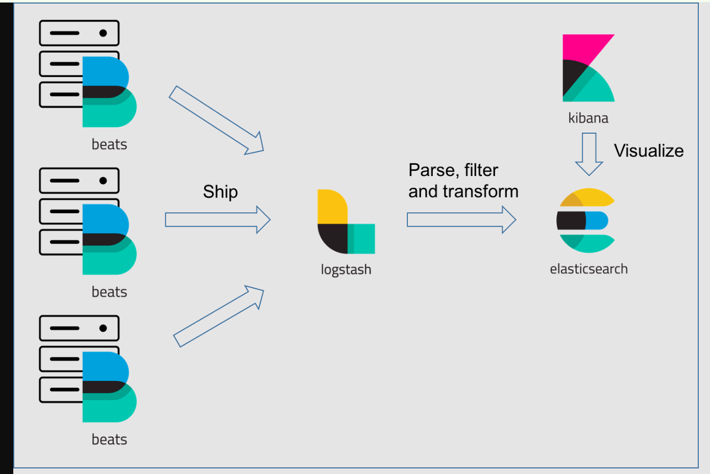
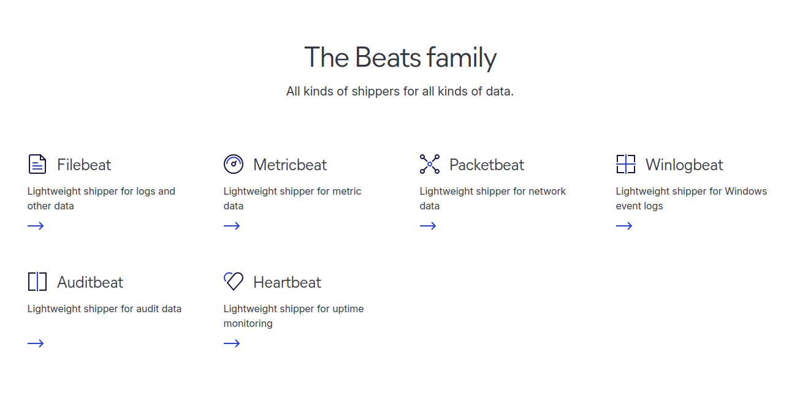
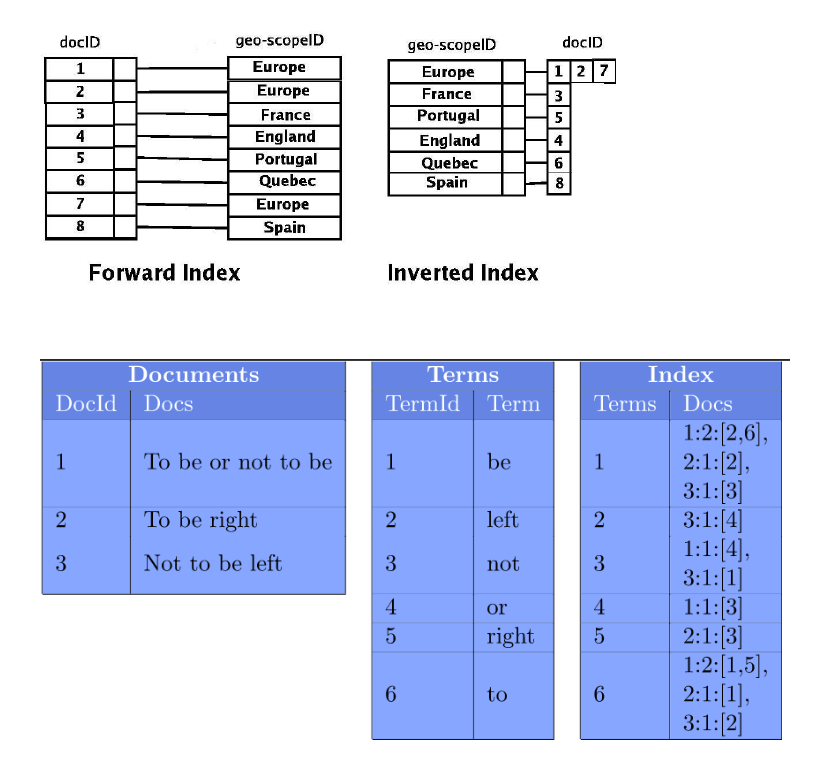

# How Elasticsearch Works: Inverted Indexes and Beyond

## Table of Contents

1. [Overview of Elastic Stack](#overview-of-elastic-stack)
2. [Architecture of Elasticsearch](#architecture-of-elasticsearch)

---

## Overview of Elastic Stack

The **Elastic Stack** (previously known as the ELK Stack) is a group of open-source tools built by **Elastic** for searching, analyzing, and visualizing data in real-time. It includes the following core components:

- **Elasticsearch** – A distributed, RESTful search and analytics engine
- **Kibana** – A visualization and dashboard tool that sits on top of Elasticsearch
- **Logstash** – A server-side data processing pipeline
- **Beats** – Lightweight data shippers for sending data from edge machines
- **X-Pack** – Adds advanced features like security, monitoring, and machine learning

These tools work together to form a full-stack solution for log and event data collection, processing, storage, search, and visualization.

---

### Component Overview

**Elasticsearch**  
An open-source analytics and full-text search engine, built in **Java**.  
- Scalable and easy to use
- Powers features like autocomplete, typo correction, and synonym matching in search systems

**Kibana**  
A dashboard interface to analyze and visualize Elasticsearch data  
- Supports charts like pie charts, bar graphs, and more  
- Ideal for real-time data exploration and dashboards

**Logstash**  
An open-source server-side data processing pipeline  
- Ingests data from various sources  
- Transforms and sends it to storage like Elasticsearch or Kafka  

**X-Pack**  
An extension that enhances Elasticsearch and Kibana with the following:

1. Security – Authentication and authorization
2. Monitoring – Performance tracking and alerting
3. Machine Learning – Anomaly detection
4. Graph – Explore relationships between data
5. SQL – Run SQL queries on Elasticsearch data

**Beats**  
A collection of lightweight agents that ship data to Logstash or Elasticsearch.

Types of Beats:

**In summary**, Elasticsearch is at the core, with data flowing in via Beats or Logstash, and Kibana used for UI and visualizations.

---

## Architecture of Elasticsearch

Elasticsearch is a powerful search and analytics engine that works by organizing your data in a way that makes it extremely fast to search through, even when dealing with huge amounts of information.
### Core Data Structure: Inverted Index
The main data structure behind Elasticsearch is called an inverted index. Think of it like the index at the back of a book, but much more powerful:
- In a regular book, you find a page number and then look for information on that page.
- With an inverted index, you start with the information(like a word) and find all the documents that contains it.
  
### How the Inverted Index Works

- Elasticsearch takes your documents and breaks them down into individual terms (words)
- It creates a list of all unique terms
For each term, it stores:
  - Which documents contain this term
  - Where in each document the term appears
  - How many times it appears

This is like creating a massive lookup table that points from words to documents, rather than from documents to words.
### Additional Data Structures
Besides the inverted index, Elasticsearch uses:
- BKD trees: For efficiently handling numeric and geographic data
- Document store: To keep original documents for retrieval
- Field data: For sorting and aggregating results quickly
- Term dictionary: For quick term lookups
- Segment files: Small chunks of the index that get periodically merged

How Searching Works
When you search for something:

Elasticsearch analyzes your query (breaking it into terms)
- It looks up these terms in the inverted index
- It finds all matching documents
- It scores and ranks these documents by relevance
- It returns the best matches

---

Source: [Mohitraj27/Elastic_Stack](https://github.com/Mohitraj27/Elastic_Stack)
